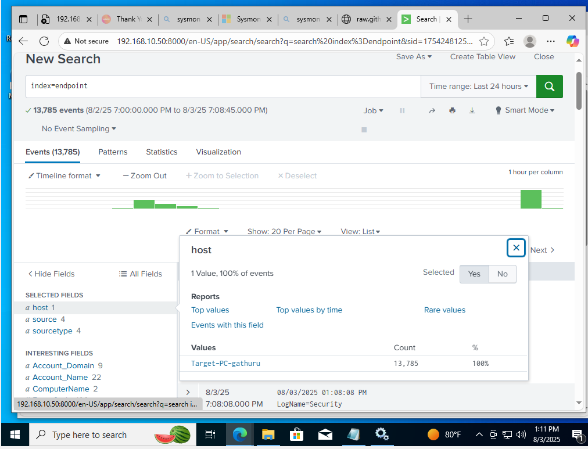
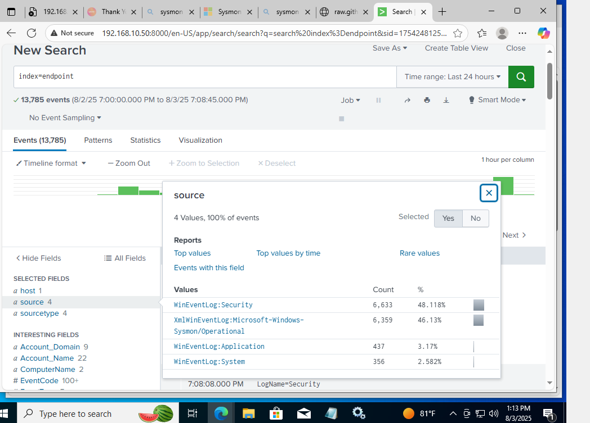

# 🔐 Cybersecurity Lab: Active Directory + Splunk Log Collection + Threat Hunting with Kali Linux

## 🧠 Lab Purpose  
This lab simulates a basic enterprise network to practice log collection, monitoring, and security analysis. It helps build foundational skills for SOC analysts and cybersecurity roles by using tools like:

- **Windows Server 2022** for Active Directory and DNS  
- **Sysmon + Splunk Universal Forwarder** to collect logs  
- **Splunk Enterprise** to monitor log activity  
- **Kali Linux** to simulate threat activity  
- **VirtualBox** to host virtual machines on 2 physical PCs (each running 2 VMs)

---

## 🧠 Skills Practiced

- Active Directory Deployment  
- Sysmon Log Collection  
- Splunk Log Ingestion and Searching  
- Network Configuration (Bridged Networking)  
- Cyber Threat Simulation with Kali Linux  
- Multi-host virtual lab design  
- Endpoint logging and SIEM fundamentals  

---

## 🖥️ Lab Architecture

| Physical Host | Virtual Machines                         | Purpose                        | Network Type |
|---------------|------------------------------------------|--------------------------------|---------------|
| PC 1 (Host 1) | VM1: Windows Server 2022 (AD DS)         | Domain Controller, DNS         | Bridged       |
|               | VM2: Windows 10 Pro                      | Target machine w/ logging tools| Bridged       |
| PC 2 (Host 2) | VM3: Kali Linux                          | Threat simulation              | Bridged       |
|               | VM4: Splunk Server (Linux or Windows)    | Log collection & analysis      | Bridged       |

> ⚠️ Each physical host runs **2 virtual machines**, and all machines are connected to the same LAN using **Bridged Adapter** mode in VirtualBox.

---

## ⚙️ Step-by-Step Lab Setup

### Step 1: Prepare Your Physical Machines
- Use 2 separate PCs connected to the same router (via Ethernet or WiFi Extender).
- Install **VirtualBox** on both hosts.

---

### Step 2: Configure Virtual Machines

**On PC 1 (Host 1):**
- **VM1:** Windows Server 2022
  - Promote to Domain Controller (AD DS)
  - Enable DNS and set a static IP
- **VM2:** Windows 10 Pro
  - Optionally join the domain
  - Install Sysmon
  - Install Splunk Universal Forwarder

**On PC 2 (Host 2):**
- **VM3:** Kali Linux
  - Used for threat simulation (nmap, brute force, etc.)
- **VM4:** Splunk Server (Linux or Windows)
  - Install Splunk Enterprise
  - Set up to receive logs from Universal Forwarder

---

### Step 3: Configure Bridged Networking
- In VirtualBox, set each VM's network to **Bridged Adapter**.
- This ensures each VM gets its own IP address on the LAN.
- Crucial for communication between VMs across different hosts.

---

### Step 4: Install and Configure Sysmon
- Download [Sysmon](https://learn.microsoft.com/en-us/sysinternals/downloads/sysmon)
- Use a config like [SwiftOnSecurity’s Sysmon config](https://github.com/SwiftOnSecurity/sysmon-config)

### Step 5: Install Splunk Universal Forwarder
- Download from [Splunk](https://www.splunk.com/en_us/download/universal-forwarder.html)
- Install on the Windows 10 Target Machine
- Configure to forward logs to your Splunk Server's IP

---

### Step 6: Configure Splunk Enterprise Server
- On the Splunk Server VM:
  - Add a TCP input (e.g., port 9997)
  - Confirm logs are being received from the Universal Forwarder
  - Set up dashboards or queries to search logs (e.g., Sysmon events)

---
**Planned Next Steps**
### Step 7: Use Kali Linux for Threat Simulation 
- Simulate attacks like:
  - Port scanning using `nmap`
  - Password spray/brute force
  - Scripted exploits for detection practice

---

## 🔭 Planned Features (Next Steps)
- Join Kali Linux and Splunk Server to the domain
- Deploy Wazuh for advanced log analysis and alerts
- Configure alerts for malicious behavior in Splunk
- Document detection techniques used in the lab

---
---

## 📸 Screenshots

### 🔧 Splunk Log Collection

### 🖥️ Event Sources

### 🏢 Domain Controller Setup

### 🧪 Test Machine Setup

### 📄 Log Configuration (`inputs.conf`)

---

## 🧾 Notes
- This lab uses **bridged mode** because I’m using **two physical machines**, and I want all VMs to behave like real networked devices.
- NAT would limit communication between VMs across separate hosts unless extra routing is configured.

## 🧾 License

This project is licensed under the [MIT License](LICENSE).

## 👨‍💻 About the Author

I'm George Gathuru, a U.S. Army Veteran transitioning into cybersecurity and IT.  
I’m passionate about hands-on learning and building practical home lab projects to reinforce skills in areas like Active Directory, log collection, threat detection, and VPN tunneling.

This project is part of my journey toward a career in cybersecurity, and it reflects the real-world scenarios I’m actively learning and documenting.

📫 [Connect with me on LinkedIn](https://www.linkedin.com/in/georgegathuru)

